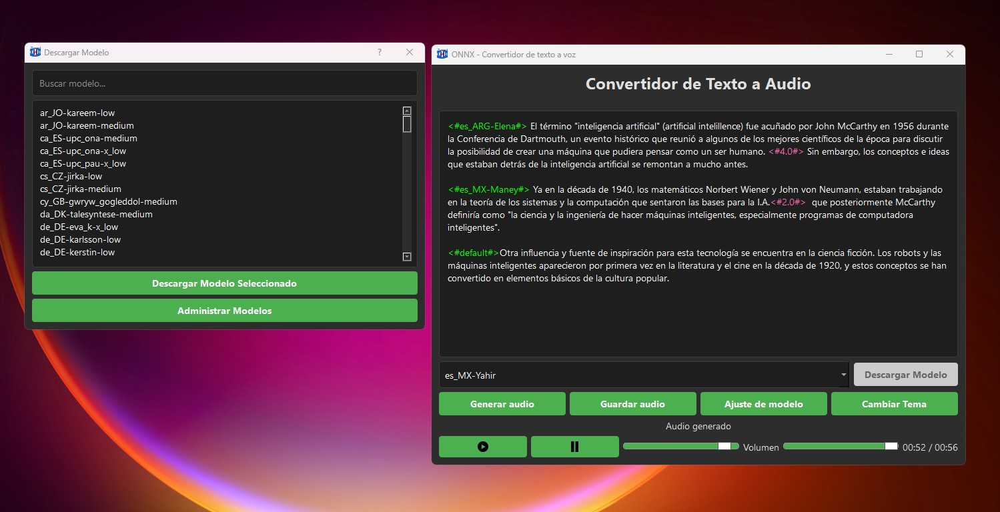

# Piper-ONNX-TTS



**Piper-ONNX-TTS** is a text-to-speech (TTS) application based on the **Piper** and **ONNX** models. This tool allows you to generate audio from text using pre-trained voice models, with an intuitive and user-friendly graphical interface.

## Key Features

- **Text-to-Speech Conversion**: Convert any text into audio using high-quality voice models.
- **User-Friendly Interface**: Modern design with intuitive controls for playback and audio adjustments.
- **Voice Customization**: Adjust parameters such as speaker, noise scale, length scale, noise W, and silence between sentences to customize the audio output.
- **Model Downloads**: Download new voice models directly from the application.
- **Audio Playback**: Play the generated audio directly within the application, with play, pause, and volume controls.
- **Save Audio**: Save the generated audio in WAV format for later use.
- **Multi-Language Support**: Supports a wide variety of languages and voices, thanks to the models available in **Piper**.
- **Advanced Settings**: Advanced settings to customize the quality and style of the generated voice.
- **Interface Themes**: Switch between light and dark themes for a better visual experience.
- **Model Management**: Manage downloaded models, including deleting unwanted models.
- **Text Search**: Functionality to search and highlight text within the input area.
- **Silence Insertion**: Add custom silences between sentences.
- **FFmpeg Integration**: Use FFmpeg for audio file generation and concatenation.

## Requirements

- **Piper**: Ensure you have the **Piper** binary (`piper.exe`) downloaded and placed in the project folder.
- **Python 3.10 or higher**: The application is developed in Python and requires the installation of several dependencies.
- **Dependencies**: Ensure you install the necessary dependencies using `pip install -r requirements.txt`.
- **FFmpeg**: The application requires FFmpeg for audio file manipulation. Ensure you have `ffmpeg.exe` in the project folder.

## Installation

1. Clone the repository:
   ```bash
   git clone https://github.com/HirCoir/Piper-ONNX-TTS.git
   ```
2. Navigate to the project folder:
   ```bash
   cd Piper-ONNX-TTS
   ```
3. Install the dependencies:
   ```bash
   pip install -r requirements.txt
   ```
4. Download the **Piper** binary from [**Piper releases**](https://github.com/rhasspy/piper/releases) and place it in the project folder.
5. Ensure you have `ffmpeg.exe` in the project folder.

## Usage

1. Run the application:
   ```bash
   python main-eng.py
   ```
2. Enter the text you want to convert in the text box.
3. Select a voice model from the dropdown list.
4. Adjust the voice parameters if necessary.
5. Click "Generate Audio" to convert the text to audio.
6. Play the generated audio or save it to your device.

## Downloads

You can find a compiled version of the project in the [Releases](https://github.com/HirCoir/Piper-ONNX-TTS/releases) section.

## Contributions

Contributions are welcome! If you wish to improve the project, please open a **Pull Request** or an **Issue** in the repository.

## License

This project is under the **MIT** license.

## Acknowledgments

- **Piper**: Thanks to the [**Piper**](https://github.com/rhasspy/piper) team for providing the voice models and the necessary binary.
- **ONNX**: Thanks to [**ONNX**](https://github.com/onnx/onnx) for providing the framework for model inference.
---

### Support the Project!

If you find this project useful, please consider making a donation. Your support helps maintain and improve this tool. Thank you!

[](https://paypal.me/hircoir)
